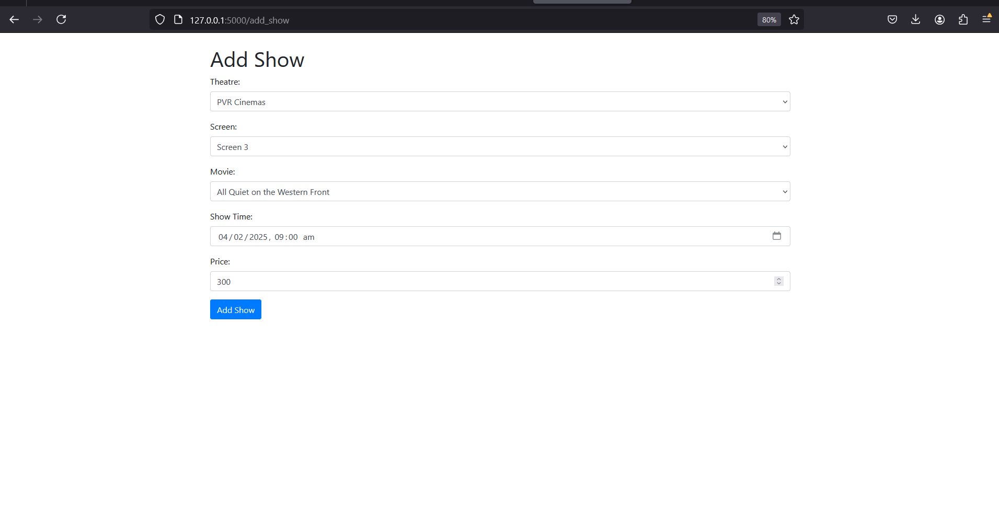

This is a Theatre Management System written in python using Flask and jinja templates. as a part of the DBMS course
 
to run the server use the command
 
<code>flask run</code>  
 
 
<b>Register Page </b>  
 
  
 
<b>User info </b>  
 
  
 
<b> Add Movie </b>  
 
  
 
<b> Add Show </b>  
 
  
 
<b> Movie list </b>  
 
  
 
<b> Booking status </b>  
 
  
 
<b> Edit Show </b>  
 
  
 
<b> Book Movie </b>  
 
  
 
<b> Booking Successful </b>  
 
  

